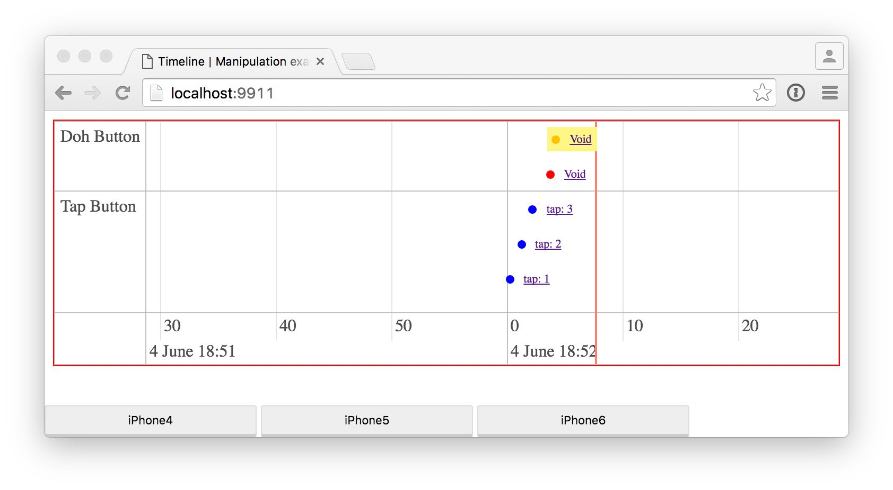

# RxVisualDebugger
WIP! Very quick and very dirty test for a visual Rx debugger

```swift
btnDoh.rx_tap
    .debugRemote("Doh Button")
    .subscribeNext {_ in
        print("doh!")
    }
    .addDisposableTo(bag)
```

`debugRemote()` will log the emitted values in the visual debugger app (an example of two buttons emitting via `rx_tap` below):

